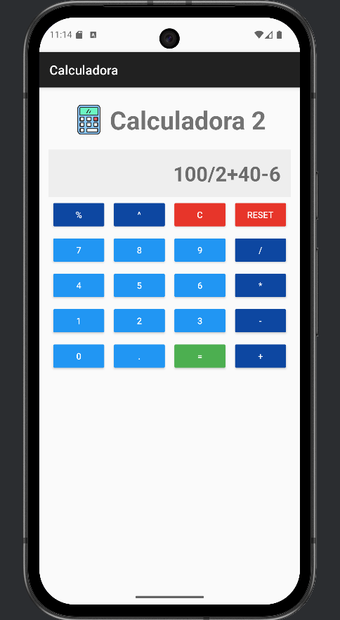

# Calculadora Android - Kotlin + Rhino

Una **calculadora básica** para Android desarrollada en **Kotlin**.  
Permite realizar operaciones simples como suma, resta, multiplicación, división, módulo y potencia.

---

## Captura de pantalla



---

## Funcionalidades

- Mostrar números y operaciones en pantalla (`TextView`).
- Operaciones soportadas: `+`, `-`, `*`, `/`, `%`, `^`.
- Botones especiales:
    - `C` → Borrar un carácter.
    - `Reset` → Limpiar todo.
    - `=` → Calcular resultado.
- Manejo de errores simples: muestra `"Error"` si la expresión no es válida.

---

## Cómo funciona

- Cada botón agrega su valor al **TextView**.
- `=` evalúa la expresión usando **Rhino**.
- Las potencias `^` se transforman en `Math.pow(a,b)` para que Rhino pueda calcularlas.

---

## Dependencias principales

```gradle
implementation 'org.mozilla:rhino:1.8.0'
implementation 'androidx.appcompat:appcompat:1.6.1'

